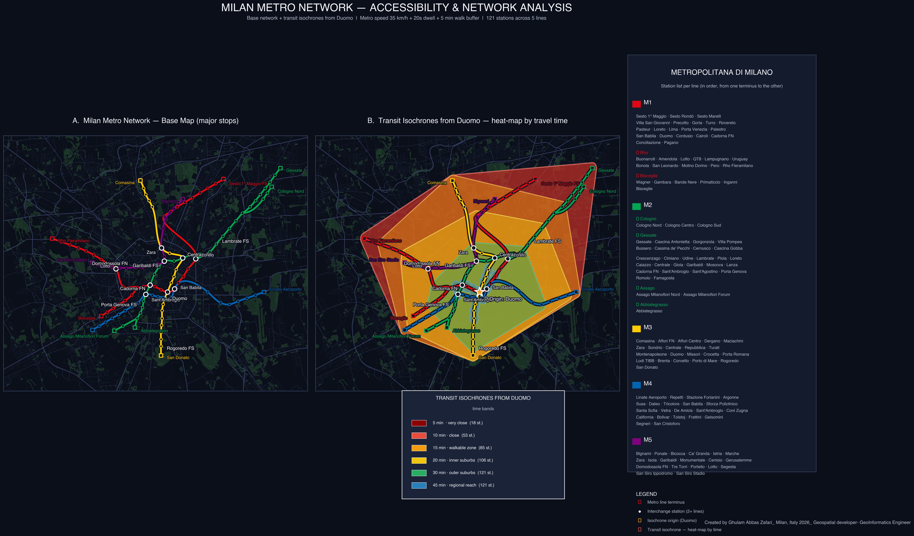

# 🚇 Milan Metro Network — Accessibility & Isochrone Analysis

A geospatial analysis of the **Milan Metro (Metropolitana di Milano)** network combined with **transit isochrones** computed from a travel-time graph. Produced entirely in Python (Jupyter Lab) using **OSMnx**, **NetworkX**, **GeoPandas**, **Matplotlib**, and **SciPy**.



---

## 📖 Overview

This project models the entire Milan Metro network as a **weighted graph** and computes **accessibility catchments** (isochrones) from a chosen origin station. The output is a **three-panel dark-theme map** designed for presentation, portfolio, and academic use.

The analysis answers the question:

> *"From Duomo, how far can I reach using only the metro, at 5, 10, 15, 20, 30, and 45 minutes?"*

---

## ✨ Features

| Feature | Description |
|---|---|
| **Complete network model** | 121 stations across 5 lines (M1, M2, M3, M4, M5) with correct topology |
| **Realistic travel-time graph** | Haversine distances + 35 km/h metro speed + 20s dwell time per stop |
| **Transit isochrones** | Dijkstra shortest-path catchments at 6 time bands (5–45 min) |
| **Walking buffer** | +5 min walk from each reachable station (400 m) |
| **Heat-map coloring** | Warm → cool palette (red → blue) shows travel time at a glance |
| **Dark theme** | Navy background, muted basemap, high-contrast metro lines |
| **Full station reference** | Every station listed per line in the side panel |
| **OSM context layers** | Roads + major parks (> 1 ha) for urban texture without visual noise |
| **Publication-ready output** | 300 DPI PNG, PDF, and SVG exports |

---

## 🗺️ The Three Panels

### Panel A — Base Network Map
Clean visualization of the Milan Metro with major stops labelled:
- **Hubs** (bold labels): Duomo, Cadorna FS, Centrale FS, Garibaldi FS
- **Interchanges** (medium): Loreto, San Babila, Lotto, Zara, Sant'Ambrogio
- **Terminals** (line-coloured): Rho Fiera, Sesto, Bisceglie, Assago, etc.

### Panel B — Transit Isochrones from Duomo
Heat-map catchments showing reachable areas at each time band:

| Time | Zone type | Stations reached |
|------|-----------|------------------|
| 5 min  | very close | 18 |
| 10 min | close | 53 |
| 15 min | walkable zone | 85 |
| 20 min | inner suburbs | 106 |
| 30 min | outer suburbs | 121 |
| 45 min | regional reach | 121 |

### Panel C — Station Reference
Complete station list per line, in travel order, with branch indicators (`↳ Rho`, `↳ Bisceglie`, etc.).

---

## 🧮 Methodology

### 1. Network graph construction
Each station is a node; each adjacent pair of stations is an edge. Edge weight = travel time in seconds:

```
travel_time = (haversine_distance / metro_speed) + dwell_time
```

Where:
- `metro_speed = 35 km/h` (Milan Metro average)
- `dwell_time = 20 s` per station
- `haversine_distance` computed in metres

### 2. Isochrone computation
For each time band `T` (in minutes):

```python
cutoff_s = T * 60
reachable = nx.single_source_dijkstra_path_length(G, origin, weight='weight', cutoff=cutoff_s)
```

Each reachable station is buffered by 5 minutes of walking (~400 m), and the union of all buffers forms the isochrone polygon.

### 3. Basemap context
- **Roads**: OSM `highway=*` (motorway → pedestrian), faint grey
- **Parks**: OSM `leisure=park` + `landuse=grass` filtered to `area > 1 ha`
- **Buildings**: intentionally excluded (visual noise)
- **Water**: intentionally excluded (small fountain dots dominated the map)

---

## 🛠️ Installation

### Requirements
- Python 3.9+
- Jupyter Lab

### Install dependencies

```bash
pip install osmnx networkx geopandas matplotlib scipy shapely contextily pandas numpy
```

Or with conda:

```bash
conda install -c conda-forge osmnx networkx geopandas matplotlib scipy shapely contextily
```

---

## 🚀 Usage

### Option 1 — Run the notebook
```bash
jupyter lab MilanMetro.ipynb
```

### Option 2 — Run as a Python script
```bash
python milan_metro_isochrones.py
```

The script will:
1. Build the metro graph (121 nodes)
2. Compute isochrones from **Duomo** at 5/10/15/20/30/45 min
3. Download OSM layers on first run (~1–2 min) and cache them
4. Render the three-panel dark-theme map
5. Save `.png`, `.pdf`, and `.svg` outputs

### Output files
```
milan_metro_isochrones_dark.png    ← 300 DPI raster
milan_metro_isochrones_dark.pdf    ← vector, print-ready
milan_metro_isochrones_dark.svg    ← vector, editable
```

---

## 🔧 Configuration

### Change the origin station
In the main function:

```python
ORIGIN = 'Duomo'      # try 'Cadorna FN', 'Centrale FS', 'Loreto', 'Garibaldi FS'
```

### Change time bands
```python
TIMES = [5, 10, 15, 20, 30, 45]     # any list of minutes
```

### Adjust metro speed
```python
METRO_SPEED_MS = 35.0 * 1000 / 3600   # 35 km/h
```

### Adjust walking buffer
```python
WALK_BUFFER_M = 400                    # 5-min walk ≈ 400 m
```

### Change park filter threshold
```python
layers = load_osm_city((9.04, 45.40, 9.32, 45.565),
                       min_park_area_m2=10000)   # keep only parks > 1 ha
```

---

## 📊 Network Statistics

| Line | Color | Length (km) | Stations | Terminals |
|------|-------|-------------|----------|-----------|
| **M1** | 🔴 Red | 27.0 | 38 | Rho Fiera / Bisceglie ↔ Sesto |
| **M2** | 🟢 Green | 40.4 | 35 | Assago / Abbiategrasso ↔ Gessate / Cologno |
| **M3** | 🟡 Yellow | 16.6 | 21 | Comasina ↔ San Donato |
| **M4** | 🔵 Blue | 15.2 | 21 | Linate Aeroporto ↔ San Cristoforo |
| **M5** | 🟣 Purple | 12.9 | 19 | Bignami ↔ San Siro Stadio |
| **Total** | — | **112 km** | **121** | — |

---

## 📁 Project Structure

```
milan_metro_isochrones/
├── MilanMetro.ipynb                    # Jupyter notebook (main analysis)
├── milan_metro_isochrones.py           # Standalone Python script
├── milan_metro_isochrones_dark.png     # Rendered output (300 DPI)
├── milan_metro_isochrones_dark.pdf     # Vector output
├── milan_metro_isochrones_dark.svg     # Vector output (editable)
├── README.md                           # This file
├── LICENSE                             # MIT License
├── .gitignore                          # Git ignore rules
├── osm_cache/                          # Auto-generated OSM cache (gitignored)
│   └── milan_city.pkl
└── admin_cache/                        # Auto-generated admin boundaries (gitignored)
    ├── comune.geojson
    └── province.geojson
```

---

## 🧰 Tech Stack

| Library | Purpose |
|---|---|
| **OSMnx** | Download OSM features (roads, parks, boundaries) |
| **NetworkX** | Graph construction + Dijkstra shortest paths |
| **GeoPandas** | Spatial data operations + plotting |
| **Shapely** | Geometric operations (buffers, convex hulls, unions) |
| **Matplotlib** | Cartographic rendering |
| **SciPy** | Spline interpolation for smooth metro lines |
| **NumPy / Pandas** | Numerical and tabular operations |

---

## 📈 Possible Extensions

- 🚶 **Walk-only isochrones** — compare metro vs. walking accessibility
- 🚌 **Multimodal network** — add buses, trams, S-lines
- 🏙️ **Population overlay** — census tracts inside each isochrone
- ⏱️ **Dynamic simulation** — rush-hour congestion effects
- 🌍 **Different cities** — adapt the `STATIONS` dict to any metro system
- 🗺️ **Interactive map** — export to Folium or Mapbox GL
- 📊 **Equity analysis** — accessibility vs. income by neighborhood

---

## 📚 References

- **Milan Metro data**: [ATM Milano](https://www.atm.it/) — Azienda Trasporti Milanesi
- **OSM data**: [OpenStreetMap](https://www.openstreetmap.org/) contributors
- **Isochrone methodology**: Vale, D. (2018). *Accessibility and transit-oriented development in European metropolitan areas*
- **Network analysis**: Boeing, G. (2017). *OSMnx: New methods for acquiring, constructing, analyzing, and visualizing complex street networks*

---

## 👤 Author

**Ghulam Abbas Zafari**
Geospatial Developer · GeoInformatics Engineer
📍 Milan, Italy

- GitHub: [@zafariabbas68](https://github.com/zafariabbas68)
- Repository: [MILAN-METRO-NETWORK-ISOCHRONE](https://github.com/zafariabbas68/MILAN-METRO-NETWORK-ISOCHRONE)

---

## 📄 License

This project is licensed under the **MIT License** — see the [LICENSE](LICENSE) file for details.

Data sources retain their original licenses:
- **OSM data**: © OpenStreetMap contributors, [ODbL](https://opendatacommons.org/licenses/odbl/)
- **ATM network data**: © Comune di Milano / ATM

---

## 🙏 Acknowledgments

- **ATM Milano** for the network data
- **OpenStreetMap contributors** for the geographic context
- **OSMnx community** for the tooling that made this analysis possible
- **London Reconnections** for the historical context on Milan's Metropolitana

---

*Built with 🐍 Python, ☕ coffee, and a 🗺️ love for transit cartography.*
